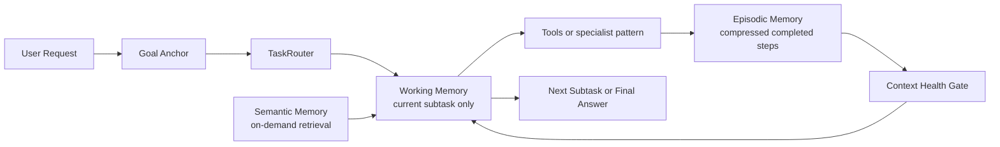

# Agent-Mode Operating Model — agent-workflow

This runbook documents how to use GitHub Copilot in agent mode effectively within
this repository. It covers the default single-entry workflow, when to use the
fallback specialist agents, when to invoke quality skills, and the definition of done.

---

## Overview

This repository uses a layered agent-mode stack:

```
.github/copilot-instructions.md              ← always-on context and production standards
.github/instructions/*.md                    ← path-scoped rules activated by file type
.github/agent-platform/workflow-manifest.json ← canonical task, capability, and skill-routing metadata
.github/agent-platform/repo-map.json          ← canonical repository topology and verification routes
.github/agent-platform/skill-registry.json   ← canonical skill inventory and trigger-tag coverage
.github/agent-platform/context-packet.schema.json ← canonical typed current-step context contract
.github/agent-platform/run-artifact-schema.json ← lightweight run-artifact format for longer workflows
.github/agents/orchestrator.agent.md         ← default single-entry workflow
.github/hooks/*.json                         ← deterministic workspace approval and validation hooks
.github/prompts/*.prompt.md                  ← on-demand wrappers for common task types
.github/skills/*/SKILL.md                    ← agent-discoverable quality gates
skills/*/SKILL.md                            ← supplemental repo checklists for release-sensitive work
```

The default path is `@orchestrator`. Stay in that agent for almost every task.
Only reach for the specialist agents when you explicitly want analysis-only,
planning-only, implementation-only, tests-only, review-only, or cleanup-only work.

The orchestrator is also responsible for automatically considering the right quality,
audit, research, and documentation checks for non-trivial work instead of leaving them
entirely to manual prompting.

The canonical workflow-routing source is `.github/agent-platform/workflow-manifest.json`.
Use `.github/agent-platform/repo-map.json` for repository topology and verification routes,
`.github/agent-platform/skill-registry.json` for skill discovery,
`.github/agent-platform/context-packet.schema.json` for typed current-step context, and
`.github/agent-platform/run-artifact-schema.json` for lightweight run summaries on longer workflows.
If workflow prose drifts from these metadata files, treat the metadata as authoritative and
update the stale docs or prompts in the same change set.

Execution-oriented entrypoints expose the built-in `execute` tool set where the workflow manifest
expects local verification or script execution: `@orchestrator`, `@implementer`, `@qa`, `@cleanup`,
and the common single-entry, greenfield, brownfield, bugfix, and test-generation prompt wrappers.
Browser-capable entrypoints expose the built-in `browser` tool set for integrated UI automation:
`@orchestrator`, `@qa`, and the single-entry, greenfield, brownfield, bugfix, test-generation, and
launch-readiness prompt wrappers. Browser automation still depends on
`workbench.browser.enableChatTools` being enabled in the editor. Terminal access does not bypass
approvals. Risky commands remain governed by
`.github/hooks/pretool-approval-policy.json` and `.vscode/settings.json`.
Those prompt files are thin task-shaping wrappers around the orchestrator, not independent workflow
engines. The repo validates their control-plane contract with
`python scripts/agent/check_workflow_benchmarks.py`, which checks prompt entrypoints, tool tiers,
and required placeholders against `.github/agent-platform/workflow-benchmarks.json`.
The default orchestrator and the common single-entry, greenfield, brownfield, bugfix,
test-generation, and launch-readiness prompt wrappers also expose `sequential-thinking/*` so the
workflow can use pinned structured reasoning during complex planning or investigation.
That MCP should be treated as scratch reasoning only: keep raw thought history out of specs, docs,
run artifacts, and final answers; prefer summary-level conclusions; and avoid routine
`export_session` / `import_session` use.
The workspace auto-approves only the repo's safe verification entrypoints:
`bash scripts/agent/verify-narrow.sh`, `bash scripts/agent/verify-broad.sh`, and
`python scripts/agent/sync_agent_platform.py --check`. Destructive, mutating, network, and remote-write
commands remain outside that allow-list.
`verify-broad.sh` now runs project-scoped Python dependency auditing through
`python scripts/agent/check_python_dependency_audit.py` so the dependency gate reflects the repo's
pinned requirements instead of the ambient local environment.

---

## Codebase-Aware Routing

The orchestrator should route itself using the real repository layout:

| Area | Meaning | Local guide |
|---|---|---|
| `src/` | Backend or shared application code when present | `src/AGENTS.md` |
| `frontend/` | React + TypeScript + Vite dashboard | `frontend/AGENTS.md` |
| `tests/` | Python unit and integration tests | `tests/AGENTS.md` |
| `docs/` | Architecture and contributor docs | `docs/AGENTS.md` |
| `deploy/`, `Dockerfile*`, `docker-compose*.yml`, `.github/workflows/` | Deployment and CI surfaces | root `AGENTS.md` + relevant instructions |

When looking for requirements, check `docs/specs/active/` first. For greenfield work,
prefer Speckit artifacts in `.specify/` and `specs/`. For brownfield work, prefer OpenSpec
change artifacts in `openspec/changes/`. Use `.github/agent-platform/repo-map.json` as the
first-pass topology map before diving into one local subtree. For non-trivial implementation work,
reconcile the chosen upstream artifacts into an active working spec in `docs/specs/active/`
before code changes.

---

## Maintaining Metadata

Use `python scripts/agent/sync_agent_platform.py --check` during normal verification to confirm
that `repo-map.json`, `skill-registry.json`, the context-packet example, and the example run artifacts are current.
Use `python scripts/agent/sync_agent_platform.py --write` after changing workflow topology,
skill inventory, or other canonical agent-platform metadata so the generated files are refreshed
before review.
Workflow control-plane changes under `.github/agent-platform/`, `.github/agents/`,
`.github/prompts/`, `.github/skills/`, `.github/workflows/`, `scripts/agent/`, `.vscode/`,
root or scoped `AGENTS.md`, `.github/copilot-instructions.md`, or `.github/PULL_REQUEST_TEMPLATE.md`
must update `docs/runbooks/agent-mode.md` and `docs/copilot-setup.md` in the same PR.
`pr-quality.yml` now enforces that companion-doc rule and runs
`python scripts/agent/sync_agent_platform.py --check` as a blocking workflow-governance check.
Example run artifacts and the context-packet example live under `.github/agent-platform/examples/`
and should stay aligned with their schemas.

---

## Context Model

The current context-engineering model keeps only the active subtask in working memory.
Completed work is compressed into episodic memory, semantic memory is loaded only on demand, and longer multi-surface workflows keep an active run artifact with a `taskLedger` trace.



### Memory tiers

| Tier | Purpose | Loading rule |
|---|---|---|
| Working memory | Current subtask objective, scratchpad, and latest relevant evidence | Only one active subtask at a time |
| Episodic memory | Compressed summaries of completed subtasks and retained facts | Always lighter than raw prior context |
| Semantic memory | Repo facts or prior knowledge retrieved for the current step | Load only when the active subtask needs it, then keep only source-backed summaries in the packet |

### Run-artifact activation

- Treat the run artifact as active by default when work is non-trivial and spans multiple surfaces, multiple subtasks, or dense evidence.
- Append a `taskLedger` entry after each completed subtask while the run artifact is active.
- If no repo-local artifact path exists, the workflow may still use an in-memory artifact policy, but docs should not claim that editor-managed state is hard-validated from the repo.
- Editor-managed memory scopes such as `/memories/repo/` can be referenced by packet metadata, but they are not ordinary workspace files and should not be documented as such.

### Context health gate

- Re-inject the one-line top-level goal at the top of every non-trivial reasoning step.
- When the working set approaches 70% utilization, trim stale tool output, compress prior subtasks,
	and keep only the goal anchor, active constraints, current-step contract, latest relevant evidence,
	and episodic memory summary.
- Raw tool output expires after the subtask that produced it unless it is promoted into evidence or episodic memory.

### Atomic task routing

- Non-trivial work should be decomposed into a DAG of atomic subtasks.
- Each node needs one input contract, one output contract, one done condition, and one route.
- If a node would take more than one LLM call, split it before execution.
- Scratchpads are local to the active node and are replaced instead of appended indefinitely.

---

## Default Internal Workflow

The orchestrator keeps the user in one conversation and internally follows this loop:

```
goal anchor → classify/task DAG → breadth scan → depth dive → spec/plan → choose approach → adversarial critique → revise → execute/review → traceability/verify → final answer
```

| Phase | What happens |
|---|---|
| Goal anchor | Re-inject the one-line top-level goal before deeper reasoning so long chains do not drift. |
| Classify / task DAG | Decide the task class and break non-trivial work into atomic routed subtasks. |
| Breadth scan | Sweep the relevant code, tests, docs, deploy, ownership, and operational surfaces before locking onto one branch. |
| Depth dive | Go deep on the highest-risk or highest-signal branches from the breadth scan and verify assumptions against actual code. |
| Spec / plan | Create or update a spec in `docs/specs/active/` for non-trivial work before code. |
| Choose approach | Prefer the simplest viable approach and compare it with at least one alternative for non-trivial tasks. |
| Adversarial critique | Challenge assumptions, missing requirements, edge cases, regression risk, security, performance, accessibility, observability, and test gaps. |
| Revise | Repair the weak parts of the plan or answer. The loop is bounded to two critique-and-revise passes. |
| Execute / review | Implement, test, review, or research according to the task classification. |
| Traceability / verify | Confirm request-to-change alignment, summarize verification, keep `run_artifact` state current, emit task telemetry when useful, and call out residual risk. |

## Spec Source Routing

| Task shape | Preferred upstream source | Execution-time source of truth |
|---|---|---|
| Greenfield feature | Speckit artifacts in `.specify/` and `specs/` | `docs/specs/active/<slug>.md` |
| Brownfield improvement or bugfix | OpenSpec change artifacts in `openspec/changes/` | `docs/specs/active/<slug>.md` |
| Already-approved implementation spec | Existing active working spec | `docs/specs/active/<slug>.md` |

## Automatic Trigger Matrix

These checks should be auto-considered by the orchestrator for non-trivial work.

| Task shape | Automatic checks |
|---|---|
| Any non-trivial task | `adversarial-review`, `requirements-traceability` |
| New or refreshed spec | `spec-validation` |
| Brownfield or bugfix work | `test-hardening`, `regression-audit`, `debug-timeline-capture` |
| Frontend or user-facing UI work | `frontend-best-practices`, `visual-qa`, accessibility review |
| Service, API, auth, execution, or runtime work | `observability-inject` plus relevant security/API checklist guidance |
| Workflow, prompt, skill, CI, or docs changes | `documentation-audit` |
| Release-sensitive or repo-health audit work | `continuous-audit` plus the relevant supplemental checklist in `skills/` |
| External-context work | research-first flow with a reusable brief in `docs/specs/research/` when outside sources materially change the conclusion |

### When phases can be compressed

| Situation | Compression |
|---|---|
| Trivial one-line fix | Combine classify, discover, and execute; still summarize verification. |
| Research-only question | Stop after recommendation, constraints, and open questions. |
| Review-only request | Skip implementation; findings come first. |
| Docs-only change | Spec creation is usually unnecessary unless the docs define new process or architecture rules. |

---

## Specialist Fallback Agents

These agents still exist under `.github/agents/`, but they are advanced/manual tools,
not the primary contributor workflow.

| Agent | Use when |
|---|---|
| `@analyst` | You want read-only brownfield mapping with no changes made |
| `@researcher` | You want external docs, ecosystem references, competitor scans, or launch-readiness benchmarking |
| `@planner` | You want a spec only |
| `@implementer` | You already have an approved spec and only want code changes |
| `@qa` | You only want tests written or hardened |
| `@reviewer` | You want an independent adversarial review |
| `@cleanup` | You want a no-behaviour-change refactor pass |

`@implementer`, `@qa`, and `@cleanup` expose the built-in `execute` tool set for local verification.
`@orchestrator` and `@qa` also expose the built-in `browser` tool set for integrated UI automation
when the editor has browser chat tools enabled. `@analyst`, `@planner`, `@researcher`, and
`@reviewer` stay more constrained by default.

---

## Quality Skills

### Agent-discoverable skills in `.github/skills/`

| Skill | Use when |
|---|---|
| `feature-discovery` | The request is vague and needs to become a concrete brief |
| `spec-validation` | A spec is created or updated |
| `adversarial-review` | A medium- or high-risk task needs self-critique |
| `requirements-traceability` | A non-trivial task needs request-to-change verification |
| `observability-inject` | New services, endpoints, jobs, or important code paths are added or changed |
| `test-hardening` | Existing coverage is weak or regressions are likely |
| `debug-timeline-capture` | Bugs, flaky tests, or launch blockers need timestamped repro evidence |
| `frontend-best-practices` | Frontend work needs architecture, performance, UX, and regression scrutiny beyond screenshots |
| `visual-qa` | UI work needs visual and accessibility validation |
| `regression-audit` | Brownfield work needs an explicit regression attack plan |
| `documentation-audit` | Workflow or architecture changes need doc drift checks |
| `continuous-audit` | Scheduled or post-merge repo-health auditing is being designed or reviewed |
| `adr` | The change introduces or documents an architectural decision |

### Supplemental repo checklists in `skills/`

| Checklist | Use when |
|---|---|
| `skills/python-quality/` | Before Python-heavy PRs |
| `skills/testing-regression/` | After changing existing logic |
| `skills/api-contract-review/` | Before merging collector or API contract changes |
| `skills/frontend-accessibility/` | Before releasing UI changes |
| `skills/docker-deploy-validation/` | Before deployment-related changes |
| `skills/docs-release-readiness/` | Before a release or large docs update |
| `skills/telemetry-observability-audit/` | Before release or telemetry-sensitive changes |
| `skills/application-security-review/` | Before production-sensitive changes |

---

## Definition of Done

A task is done when:

1. The request or spec is still traceable to the implemented or proposed outcome.
2. All relevant verification work is complete and summarized.
3. Any required spec in `docs/specs/active/` is current.
4. Docs are updated if the workflow, architecture, or contributor guidance changed.
5. Residual risks and unverified assumptions are called out explicitly.
6. Longer investigations or cross-surface changes keep a run artifact active when the evidence would otherwise be lost in chat history.
7. Release-sensitive changes have consulted the relevant checklist in `skills/`.
8. External research and documentation coverage are captured when they materially affect the result.

---

## Continuous Audit Model

The normal CI lane remains the blocking verification path. Continuous audit work is for
post-merge or scheduled confidence signals and should start mostly informational.

Prefer a small number of high-signal audits first:

1. Test flakiness reruns
2. Coverage deltas
3. Dependency and CVE drift
4. Docs and link health
5. Repo-health summaries for workflow drift

Do not promote these checks to blocking until their signal quality is understood.

---

## External Context Limits

This repository supports fetch-based and GitHub-based research, ships `sequential-thinking` for
local structured reasoning, and ships optional Tavily web search through `.vscode/mcp.json` when
`TAVILY_API_KEY` is configured.
It still does not, by itself, change editor approval-policy behavior.

When outside references materially affect a decision:

1. Run research-first behavior.
2. Save a brief under `docs/specs/research/<slug>-research.md`.
3. Reference that brief from the active spec.
4. Distinguish verified facts from inference.

If broader search is required, treat missing Tavily credentials or MCP setup as a workspace
configuration gap. Autoapproval remains a separate editor configuration task outside `.github/`.

---

## Prompt Roadmap

Use these prompts as thin wrappers around the default orchestrator.
The benchmark harness validates their stable contract, not end-to-end model quality.

| Prompt | Use when |
|---|---|
| `single-entry-workflow.prompt.md` | Start almost any non-trivial task |
| `greenfield-feature.prompt.md` | Starting a new feature from an idea or brief |
| `brownfield-improve.prompt.md` | Improving or extending existing code |
| `bugfix-workflow.prompt.md` | Investigating and fixing a bug with root-cause focus |
| `research.prompt.md` | External research is needed before planning or implementation |
| `generate-tests.prompt.md` | You want a focused test-writing or test-hardening pass |
| `review-code.prompt.md` | You want an independent code review response |
| `launch-readiness-audit.prompt.md` | You want a repo-wide launch, onboarding, or time-to-value audit |

---

## Advanced Manual Path

If you intentionally want the old specialist workflow, use this manual sequence:

1. `@researcher` if external references or benchmarks are needed.
2. `@analyst` for read-only mapping if the task is brownfield and unclear.
3. `@planner` for a spec if the task is non-trivial.
4. `@implementer` for code from the approved spec.
5. `@qa` for tests.
6. `@reviewer` for an adversarial review.
7. `@cleanup` for an optional no-behaviour-change pass.

This path is supported, but it is no longer the default guidance.

---

## Expanding This Stack Over Time

As the repo grows, extend this operating model by:

1. Adding new instruction files under `.github/instructions/` with narrow `applyTo` patterns.
2. Adding new thin prompt wrappers under `.github/prompts/` only when an existing wrapper cannot
	express the recurring task shape cleanly.
3. Refreshing `.github/agent-platform/repo-map.json` and `.github/agent-platform/skill-registry.json` whenever the topology or skill inventory changes.
4. Adding deterministic hooks under `.github/hooks/` when behavior must be enforced instead of merely suggested.
5. Adding agent-discoverable skills under `.github/skills/` for reusable workflow logic.
6. Keeping `skills/` as a curated set of release and domain checklists.
7. Updating `docs/copilot-setup.md` whenever the public workflow changes.
